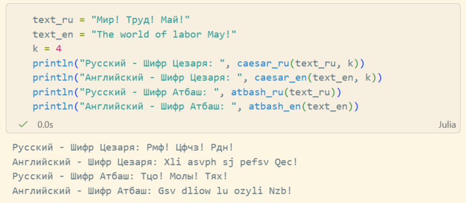

---
## Front matter
lang: ru-RU
title: Лабораторная работа №1
subtitle: "Шифры простой замены"
author:
  - Кадрова Ангелина Александровна
teacher:
  - Кулябов Д. С.
  - д.ф.-м.н., профессор
  - профессор кафедры теории вероятностей и кибербезопасности 
institute:
  - Российский университет дружбы народов имени Патриса Лумумбы, Москва, Россия
date: 11 сентября 2026

## i18n babel
babel-lang: russian
babel-otherlangs: english

## Formatting pdf
toc: false
toc-title: Содержание
slide_level: 2
aspectratio: 169
section-titles: true
theme: metropolis
header-includes:
 - \metroset{progressbar=frametitle,sectionpage=progressbar,numbering=fraction}
---

## Докладчик

:::::::::::::: {.columns align=center}
::: {.column width="70%"}

  * Кадрова Ангелина Александровна
  * Cтудентка НФИмд-02-26
  * Российский университет дружбы народов имени Патриса Лумумбы
  * [1032262509@rudn.ru](mailto:1032262509@rudn.ru)
  * <https://github.com/aakadrova>

:::
::: {.column width="30%"}


:::
::::::::::::::

## Цели и задачи

**Цель работы**

Основная цель работа — изучить и реализовать шифры Цезаря и Атбаш для русского и английского алфавитов.

**Задание**

С помощью языка программирования Julia реализовать:

- шифр Цезаря с произвольным ключом k,
- шифр Атбаш.

## Выполнение лабораторной работы

Шифр Цезаря — один из древнейших и простейших шифров. Его суть в том, что каждая буква исходного текста заменяется на букву, сдвинутую на фиксированное число позиций в алфавите. Например, при сдвиге на 3 буква A становится D, B — E и так далее. Такой сдвиг одинаков для всего текста.

## Выполнение лабораторной работы

```julia
function caesar_ru(text, k)
    alphabet = collect("абвгдеёжзийклмнопрстуфхцчшщъыьэюя")
    result = []
    for char in text
        lower = lowercase(char)
        index = findfirst(isequal(lower), alphabet)

        if index != nothing
            new_index = mod(index + k - 1, 33) + 1
            new_char = alphabet[new_index]

            if isuppercase(char)
                push!(result, uppercase(new_char))
            else
                push!(result, new_char)
            end
        else
            push!(result, char)
        end
    end
    return join(result)
end
```

## Выполнение лабораторной работы

```julia
function caesar_en(text, k)
    result = []
    for char in text
        if 'a' <= char <= 'z'
            new_char = Char(mod(Int(char) - Int('a') + k, 26) + Int('a'))
            push!(result, new_char)
        elseif 'A' <= char <= 'Z'
            new_char = Char(mod(Int(char) - Int('A') + k, 26) + Int('A'))
            push!(result, new_char)
        else
            push!(result, char)
        end
    end
    return join(result)
end
```
## Выполнение лабораторной работы

Шифр Атбаш — это частный случай аффинного шифра, где буквы алфавита заменяются на «зеркальные» буквы: первая буква заменяется на последнюю, вторая — на предпоследнюю и так далее.

## Выполнение лабораторной работы

```julia
function atbash_ru(text)
    alphabet = collect("абвгдеёжзийклмнопрстуфхцчшщъыьэюя")
    result = []
    for char in text
        lower = lowercase(char)
        index = findfirst(isequal(lower), alphabet)
        if index != nothing
            new_index = 34 - index
            new_char = alphabet[new_index]
            if isuppercase(char)
                push!(result, uppercase(new_char))
            else
                push!(result, new_char)
            end
        else 
            push!(result, char)
        end
    end
    return join(result)
end
```

## Выполнение лабораторной работы

```julia
function atbash_en(text)
    result = []
    for char in text
        if 'a' <= char <= 'z'
            new_char = Char(Int('z') - (Int(char) - Int('a')))
            push!(result, new_char)
        elseif 'A' <= char <= 'Z'
            new_char = Char(Int('Z') - (Int(char) - Int('A')))
            push!(result, new_char)
        else
            push!(result, char)
        end
    end
    return join(result)
end
```

## Выполнение лабораторной работы

{#fig:001 width=70%}


## Вывод

С помощью языка программирования Julia были реализованы:

- шифр Цезаря для русского и английского алфавитов,
- шифр Атбаш для русского и английского алфавитов.
