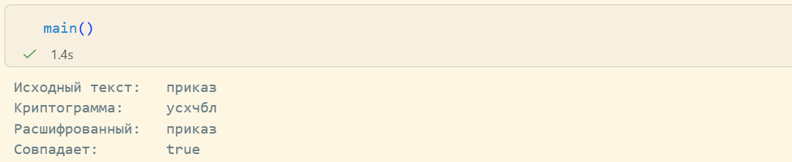

---
## Front matter
title: "Лабораторная работа №3"
subtitle: "Шифрование гаммированием"
author: "Кадрова Ангелина Александровна"

## Generic otions
lang: ru-RU
toc-title: "Содержание"

## Bibliography
bibliography: bib/cite.bib
csl: pandoc/csl/gost-r-7-0-5-2008-numeric.csl

## Pdf output format
toc: true # Table of contents
toc-depth: 2
lof: true # List of figures
lot: false # List of tables
fontsize: 12pt
linestretch: 1.5
papersize: a4
documentclass: scrreprt
## I18n polyglossia
polyglossia-lang:
  name: russian
  options:
	- spelling=modern
	- babelshorthands=true
polyglossia-otherlangs:
  name: english
## I18n babel
babel-lang: russian
babel-otherlangs: english
## Fonts
mainfont: IBM Plex Serif
romanfont: IBM Plex Serif
sansfont: IBM Plex Sans
monofont: IBM Plex Mono
mathfont: STIX Two Math
mainfontoptions: Ligatures=Common,Ligatures=TeX,Scale=0.94
romanfontoptions: Ligatures=Common,Ligatures=TeX,Scale=0.94
sansfontoptions: Ligatures=Common,Ligatures=TeX,Scale=MatchLowercase,Scale=0.94
monofontoptions: Scale=MatchLowercase,Scale=0.94,FakeStretch=0.9
mathfontoptions:
## Biblatex
biblatex: true
biblio-style: "gost-numeric"
biblatexoptions:
  - parentracker=true
  - backend=biber
  - hyperref=auto
  - language=auto
  - autolang=other*
  - citestyle=gost-numeric
## Pandoc-crossref LaTeX customization
figureTitle: "Рис."
tableTitle: "Таблица"
listingTitle: "Листинг"
lofTitle: "Список иллюстраций"
lotTitle: "Список таблиц"
lolTitle: "Листинги"
## Misc options
indent: true
header-includes:
  - \usepackage{indentfirst}
  - \usepackage{float} # keep figures where there are in the text
  - \floatplacement{figure}{H} # keep figures where there are in the text
---

# Введение

## Цели и задачи

**Цель работы**

Основная цель работы — изучить и реализовать шифрование гаммированием.

**Задание**

С помощью языка программирования Julia реализовать алгоритм шифрования гаммированием конечной гаммой.

## Теоретическое введение

Julia — высокоуровневый свободный язык программирования с динамической типизацией, созданный для математических вычислений[@julialang]. Эффективен также и для написания программ общего назначения. Синтаксис языка схож с синтаксисом других математических языков, однако имеет некоторые существенные отличия.
Для выполнения заданий была использована официальная документация Julia[@juliadoc].

# Выполнение лабораторной работы

**Шифрование гаммированием** — симметричный метод шифрования, при котором к открытым данным(тексту) применяется операция наложения с последовательностью чисел, называемой гаммой.

```julia
alphabet = collect("абвгдежзийклмнопрстуфхцчшщьыъэюя ")
MOD = 33

function char_to_num(c)
    return findfirst(==(c), alphabet)
end

function num_to_char(n)
    if n == 0
        n = MOD
    end
    return alphabet[n]
end

function encrypt(text, gamma)
    text_chars  = collect(lowercase(text))
    gamma_chars = collect(lowercase(gamma))

    encrypted = ""

    for i in 1:length(text_chars)
        p = char_to_num(text_chars[i])
        k = char_to_num(gamma_chars[(i - 1) % length(gamma_chars) + 1])
        c = (p + k) % MOD
        encrypted *= num_to_char(c)
    end

    return encrypted
end

function decrypt(cryptogram, gamma)
    crypto_chars = collect(lowercase(cryptogram))
    gamma_chars  = collect(lowercase(gamma))

    decrypted = ""

    for i in 1:length(crypto_chars)
        c = char_to_num(crypto_chars[i])
        k = char_to_num(gamma_chars[(i - 1) % length(gamma_chars) + 1])
        p = mod(c - k, MOD)
        decrypted *= num_to_char(p)
    end

    return decrypted
end

function main()
    text  = "приказ"
    gamma = "гамма"

    cryptogram = encrypt(text, gamma)
    decrypted  = decrypt(cryptogram, gamma)

    println("Исходный текст:   ", text)
    println("Криптограмма:     ", cryptogram)
    println("Расшифрованный:   ", decrypted)
    println("Совпадает:        ", decrypted == text)
end

main()
```

В результате получим следующее(рис. [-@fig:001]):

{#fig:001 width=100%}


# Вывод


С помощью языка программирования Julia был реализован алгоритм шифрования гаммированием конечной гаммой.

# Список литературы{.unnumbered}

::: {#refs}
:::
