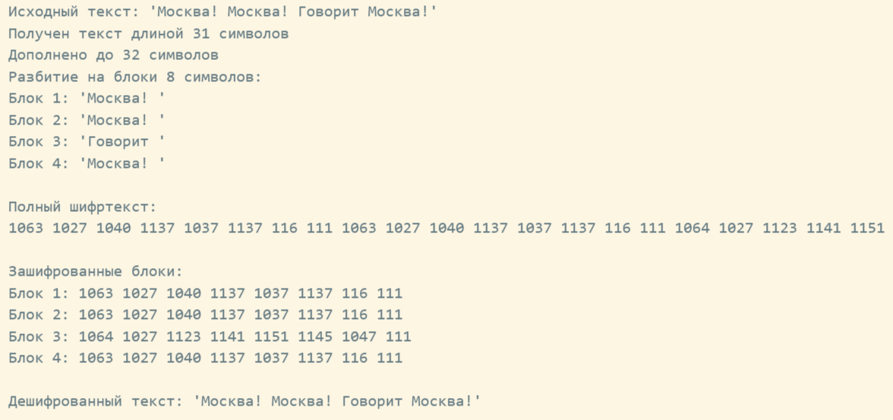

---
## Front matter
lang: ru-RU
title: Доклад
subtitle: "Режим электронной книги (ECB)"
author:
  - Кадрова Ангелина Александровна
teacher:
  - Кулябов Д. С.
  - д.ф.-м.н., профессор
  - профессор кафедры теории вероятностей и кибербезопасности 
institute:
  - Российский университет дружбы народов имени Патриса Лумумбы, Москва, Россия

## i18n babel
babel-lang: russian
babel-otherlangs: english

## Formatting pdf
toc: false
toc-title: Содержание
slide_level: 2
aspectratio: 169
section-titles: true
theme: metropolis
header-includes:
 - \metroset{progressbar=frametitle,sectionpage=progressbar,numbering=fraction}
---

## Докладчик

:::::::::::::: {.columns align=center}
::: {.column width="70%"}

  * Кадрова Ангелина Александровна
  * Cтудентка НФИмд-02-26
  * Российский университет дружбы народов имени Патриса Лумумбы
  * [1032262509@rudn.ru](mailto:1032262509@rudn.ru)
  * <https://github.com/aakadrova>

:::
::: {.column width="30%"}


:::
::::::::::::::

## Введение

**Цель доклада** -- изучить режим электронной кодовой книги.

**Задачи:** 

- Рассмотреть математическое определение режима ECB
- Реализовать алгоритм на языке Julia
- Проанализировать криптографические уязвимости
- Определить области допустимого применения

ECB — это режим шифрования, в котором каждый блок данных шифруется **независимо** от всех остальных блоков с использованием одного и того же ключа.

## Математическое определение режима ECB

Пусть задан блочный шифр $E_k$ с размером блока $n$ бит и ключом $k$.

**Разбиение и дополнение:**
$$M' = M_1 \| M_2 \| \dots \| M_m$$

**Поблочное шифрование:**
$$C_i = E_k(M_i), \quad i = 1, 2, \dots, m$$

**Формирование шифртекста:**
$$C = C_1 \| C_2 \| \dots \| C_m$$

**Дешифрование:**
$$M_i = D_k(C_i)$$


## Реализация алгоритма на языке Julia

```julia
function ecb_encrypt(text, key, block_size=8)
    padded = collect(text)
    original_len = length(padded)
    while length(padded) % block_size != 0
        push!(padded, ' ')
    end
    for i in 1:block_size:length(padded)
        block = padded[i:i+block_size-1]
    end
    key_chars = collect(key)
    ciphertext = Char[]
    for i in 1:block_size:length(padded)
        block = padded[i:i+block_size-1]
        encrypted_block = crypt_block(block, key_chars)
        append!(ciphertext, encrypted_block)
    end
    return ciphertext, original_len
end
```

## Реализация алгоритма на языке Julia

{#fig:001 width=95%}

## Криптографический анализ и уязвимости

1. **Детерминированность:** $M_i = M_j \Rightarrow C_i = C_j$
2. **Отсутствие межблочной диффузии:** изменение бита в $M_i$ влияет только на $C_i$
3. **Уязвимость к подмене блоков:** 
- Переставить блоки местами: $C_1 \| C_2 \| C_3 \to C_3 \| C_1 \| C_2$
- Дублировать блоки: $C_1 \| C_2 \to C_1 \| C_1 \| C_2$
- Вставить известные блоки из другого зашифрованного текста.
4. **Атака по словарю:** составление таблицы «открытый блок → шифртекст»

## Наглядная демонстрация уязвимости: шифрование изображения пингвина Tux

{#fig:002 width=40%}

## Области применения режима

Несмотря на недостатки, ECB применяется в задачах:

1. **Шифрование случайных данных** (ключи, токены) — вероятность совпадения блоков пренебрежимо мала
2. **Аппаратные реализации** — массовый параллелизм, максимальная пропускная способность
3. **Криптографические примитивы** — генераторы псевдослучайных чисел, базовые конструкции

## Заключение

**Преимущества ECB:**

- Математическая прозрачность
- Высокая скорость работы
- Полный параллелизм

**Недостатки:**

- Сохранение статистических закономерностей
- Уязвимость к атаке по словарю
- Отсутствие межблочной диффузии

**ECB — исторически важный, но устаревший режим для защиты конфиденциальных данных.**
