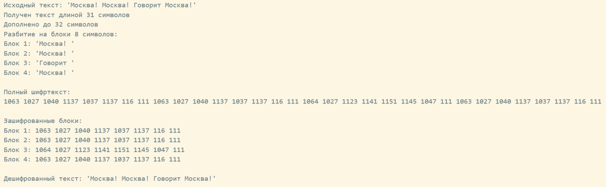

---
## Front matter
title: "Доклад"
subtitle: "Режим электронной книги (ECB)"
author: "Кадрова Ангелина Александровна"

## Generic otions
lang: ru-RU
toc-title: "Содержание"

## Bibliography
bibliography: bib/cite.bib
csl: pandoc/csl/gost-r-7-0-5-2008-numeric.csl

## Pdf output format
toc: true # Table of contents
toc-depth: 2
lof: true # List of figures
lot: false # List of tables
fontsize: 12pt
linestretch: 1.5
papersize: a4
documentclass: scrreprt
## I18n polyglossia
polyglossia-lang:
  name: russian
  options:
	- spelling=modern
	- babelshorthands=true
polyglossia-otherlangs:
  name: english
## I18n babel
babel-lang: russian
babel-otherlangs: english
## Fonts
mainfont: IBM Plex Serif
romanfont: IBM Plex Serif
sansfont: IBM Plex Sans
monofont: IBM Plex Mono
mathfont: STIX Two Math
mainfontoptions: Ligatures=Common,Ligatures=TeX,Scale=0.94
romanfontoptions: Ligatures=Common,Ligatures=TeX,Scale=0.94
sansfontoptions: Ligatures=Common,Ligatures=TeX,Scale=MatchLowercase,Scale=0.94
monofontoptions: Scale=MatchLowercase,Scale=0.94,FakeStretch=0.9
mathfontoptions:
## Biblatex
biblatex: true
biblio-style: "gost-numeric"
biblatexoptions:
  - parentracker=true
  - backend=biber
  - hyperref=auto
  - language=auto
  - autolang=other*
  - citestyle=gost-numeric
## Pandoc-crossref LaTeX customization
figureTitle: "Рис."
tableTitle: "Таблица"
listingTitle: "Листинг"
lofTitle: "Список иллюстраций"
lotTitle: "Список таблиц"
lolTitle: "Листинги"
## Misc options
indent: true
header-includes:
  - \usepackage{indentfirst}
  - \usepackage{float} # keep figures where there are in the text
  - \floatplacement{figure}{H} # keep figures where there are in the text
---

# Введение

Блочные шифры являются фундаментальным инструментом симметричной криптографии. Однако сам по себе блочный шифр способен обрабатывать только данные фиксированного размера. Для работы с сообщениями произвольной длины необходимы специальные алгоритмы, называемые режимами шифрования (modes of operation).

**Цель доклада** -- изучить режим электронной кодовой книги.

**Задачи:** 

- Рассмотреть математическое определение режима ECB
- Реализовать алгоритм на языке Julia
- Проанализировать криптографические уязвимости
- Определить области допустимого применения

Режим электронной кодовой книги (Electronic Codebook, ECB) является простейшим и исторически первым стандартизированным режимом шифрования. Его название происходит от аналогии с физическими кодовыми книгами, где слова или фразы заменялись на зафиксированные шифрованные эквиваленты. В режиме ECB каждый блок шифруется независимо от всех остальных блоков с использованием одного и того же ключа[@nist_sp_800_38a].

Исторически режим ECB был впервые формализован в 1980 году в стандарте FIPS 81, описывающем режимы работы блочного шифра DES, принятого Национальным бюро стандартов США (ныне NIST) в 1977 году. Долгое время он считался базовым способом шифрования данных и применялся в первых реализациях криптографических систем. Однако по мере развития криптоанализа и роста требований к безопасности стали проявляться его фундаментальные недостатки, что привело к постепенному отказу от ECB в пользу более совершенных режимов[@nist_decision_2023].

# Математическое определение режима ECB

Пусть задан блочный шифр $E_k$ с размером блока $n$ бит и ключом $k$. Процесс шифрования в режиме ECB определяется следующим образом.

## Разбиение и дополнение (Padding)

Исходное сообщение $M$ разбивается на последовательность блоков длины $n$ бит. Если длина сообщения не кратна $n$, применяется функция дополнения (padding), например, добавление пробелов:

$$
M' = M_1 \| M_2 \| \dots \| M_m
$$

где $M_i \in \{0,1\}^n$, а $\|$ обозначает операцию конкатенации.

## Поблочное шифрование

Функция шифра $E_k$ применяется последовательно и независимо к каждому отдельному блоку открытого текста $M_i$:

$$
C_i = E_k(M_i), \quad \text{для } i = 1, 2, \dots, m
$$

## Формирование шифртекста

Зашифрованный текст $C$ формируется путём конкатенации зашифрованных блоков:

$$
C = C_1 \| C_2 \| \dots \| C_m
$$

## Дешифрование

Выполняется независимо для каждого блока путём применения обратной функции $D_k$:

$$
M_i = D_k(C_i), \quad \text{для } i = 1, 2, \dots, m
$$

Ключевой особенностью ECB является **полная независимость** обработки каждого блока[@nist_sp_800_38a].

# Реализация алгоритма на языке Julia

Ниже представлена упрощенная реализация режима ECB. Код демонстрирует основную логику режима: разбиение на блоки, независимое шифрование каждого блока, сборку результата и дешифрование.
```julia
function crypt_block(block, key_chars)
    result = Char[]
    for (i, c) in enumerate(block)
        key_val = Int(key_chars[(i-1) % length(key_chars) + 1])
        shift = (key_val + i) % 256
        push!(result, Char(Int(c) ⊻ shift))
    end
    return result
end

function ecb_encrypt(text, key, block_size=8)
    println("Получен текст длиной $(length(text)) символов")
    padded = collect(text)
    original_len = length(padded)
    while length(padded) % block_size != 0
        push!(padded, ' ')
    end
    println("Дополнено до $(length(padded)) символов")
    println("Разбитие на блоки $block_size символов: ")
    for i in 1:block_size:length(padded)
        block = padded[i:i+block_size-1]
        println("Блок $((i-1)÷block_size+1): '$(join(block))'")
    end
    key_chars = collect(key)
    ciphertext = Char[]
    for i in 1:block_size:length(padded)
        block = padded[i:i+block_size-1]
        encrypted_block = crypt_block(block, key_chars)
        append!(ciphertext, encrypted_block)
    end
    return ciphertext, original_len
end

function ecb_decrypt(ciphertext, key, original_len, block_size=8)
    key_chars = collect(key)
    plaintext = Char[]
    for i in 1:block_size:length(ciphertext)
        append!(plaintext, crypt_block(ciphertext[i:i+block_size-1], key_chars))
    end
    return join(plaintext[1:original_len])
end

function demonstrate_ecb()
    text = "Москва! Москва! Говорит Москва!"
    key = "ключ"
    println("Исходный текст: '$text'")
    encrypted, _ = ecb_encrypt(text, key)
    ascii_codes = [Int(c) for c in encrypted]
    
    ascii_str = join(ascii_codes, " ")
    println("\nПолный шифртекст:")
    println(ascii_str)
    
    println("\nЗашифрованные блоки:")
    for i in 1:8:length(encrypted)
        block_str = join(ascii_codes[i:i+7], " ")
        println("Блок $((i-1)÷8+1): $block_str")
    end
end
demonstrate_ecb()
```

После запуска получим следующее (рис. [-@fig:001]):

{#fig:001 width=100%}

В ходе выполнения алгоритма исходное сообщение длиной 31 символ было дополнено до 32 символов (для кратности размеру блока $n=8$) и разделено на четыре блока, три из которых содержали идентичную фразу «Москва!». Результат шифрования наглядно демонстрирует недостаток режима ECB. Из одинаковых блоков текста получились абсолютно идентичные зашифрованные блоки.

# Криптографический анализ и уязвимости

## Детерминированность

$$
M_i = M_j \Rightarrow C_i = C_j
$$

Одинаковые блоки открытого текста всегда порождают одинаковые блоки зашифрованного текста. Это нарушает идею незаметности.

## Отсутствие межблочной диффузии

В ECB изменение бита в блоке $M_i$ влияет строго на соответствующий блок $C_i$ и не распространяется на другие блоки. С одной стороны, это обеспечивает помехоустойчивость: повреждение одного зашифрованного блока при передаче не затрагивает остальные. С другой стороны, это означает отсутствие межблочной диффузии, свойства, при котором изменение одного блока открытого текста влияет на все последующие блоки шифртекста. Межблочная диффузия является одним из базовых требований к криптостойким режимам шифрования, поскольку она затрудняет локальный криптоанализ и подмену отдельных фрагментов данных. В ECB такое распространение отсутствует[@nist_sp_800_38a].

## Уязвимость к подмене блоков (Malleability)

Поскольку блоки шифруются независимо, то злоумышленник может:

- Переставить блоки местами: $C_1 \| C_2 \| C_3 \to C_3 \| C_1 \| C_2$
- Дублировать блоки: $C_1 \| C_2 \to C_1 \| C_1 \| C_2$
- Вставить известные блоки из другого зашифрованного текста.

При дешифровании получаются осмысленные, но модифицированные данные. ECB не обеспечивает целостности данных.

## Атака по словарю (Codebook Attack)

Название режима «электронная кодовая книга» напрямую связано с атакой по словарю. Ее суть заключается в следующем: поскольку каждый блок открытого текста всегда отображается в один и тот же блок шифртекста, злоумышленник может составить таблицу соответствий «открытый блок → шифртекст» для наиболее вероятных фрагментов сообщения (типичных слов, стандартных заголовков, известных структур данных).

В дальнейшем, перехватив новый шифртекст, зашифрованный тем же ключом, атакующий может путём простого сопоставления с составленным словарём восстановить значительную часть исходного сообщения, **вообще не зная секретного ключа**. Фактически, шифр превращается в обычную кодовую книгу, набор фиксированных соответствий, которые можно заранее вычислить или подсмотреть.

Особенно опасна эта атака для сообщений с предсказуемой структурой: протоколов связи, баз данных, файловых форматов, где многие блоки заведомо известны или легко угадываются[@nist_bcm_project].

# Наглядная демонстрация уязвимости: шифрование изображения пингвина Tux

Классической наглядной иллюстрацией (рис. [-@fig:002]) режима ECB является шифрование рисунка пингвина Tux (талисмана Linux) [@wikimedia_tux_ecb].

{#fig:002 width=80%}

Исходное изображение содержит большие однородные области, например, сплошной белый фон и черные элементы тела пингвина. Когда картинка шифруется в режиме ECB, повторяющиеся блоки пикселей превращаются в одинаковые зашифрованные блоки.

В результате на зашифрованной картинке полностью сохраняются геометрические контуры и узнаваемый силуэт пингвина Tux[@ecb_penguin_valsorda].

# Области применения режима

Несмотря на недостатки, ECB имеет различные области применения, где его особенности не являются уязвимостями:

## Шифрование случайных данных

Если входные данные уже являются случайным шумом (например, сессионные ключи, случайные токены), вероятность совпадения исходных блоков пренебрежимо мала, а следовательно, не возникает и проблема одинаковых шифртекстов.

## Аппаратные реализации

Полная независимость блоков позволяет реализовать массовый параллелизм на аппаратном уровне. Все блоки можно шифровать одновременно, что обеспечивает максимальную пропускную способность.

## Криптографические примитивы

ECB используется внутри более сложных конструкций, например, в генераторах псевдослучайных чисел или в режимах, требующих обращения к блочному шифру как к идеальной псевдослучайной перестановке[@nist_decision_2023].

# Заключение

Режим электронной кодовой книги (ECB) является исторически важным и концептуально простым алгоритмом, который заложил основы для построения всех последующих режимов шифрования. Его математическая прозрачность, высокая скорость работы и возможность полного параллелизма делают его удобным инструментом в ряде специализированных задач, например, при шифровании случайных данных и в аппаратных реализациях.

Однако накопленный опыт криптоанализа и практического применения показал, что ECB не способен обеспечить необходимый уровень безопасности для защиты конфиденциальной информации общего назначения. Сохранение статистических закономерностей, уязвимость к атаке по словарю и отсутствие межблочной диффузии делают этот режим устаревшим для большинства современных задач.

# Список литературы{.unnumbered}

::: {#refs}
:::
